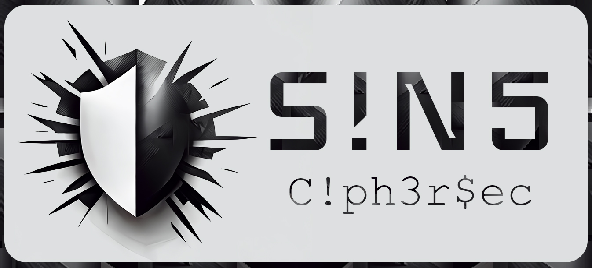

<h1 align="center">
  <br>
    <a href="https://github.com/GTekSD/SINS-CipherSec.git"></a>
  </br>
</h1>


# SINS-CipherSec


> "Advanced Password Management with SINS CipherSec: Securing Online Accounts with Unbreakable Passwords"

A python script to help people secure their online accounts by generating strong, unique passwords and storing them in a secure manner and help people assess the strength of their passwords and generate new, stronger passwords if necessary. This could involve creating a simple password checker.

*SINS-CipherSec** is being actively developed by [@GTekSD](https://twitter.com/GTekSD) [@Pathamadai](https://twitter.com/AbuAhmadFareez/) [@SanoJ](https://twitter.com/) and [@Sabiro](https://twitter.com/sabir_becker/)

Table of Contents
------------
* [Installation](#installation--usage)
* [Options](#options)
* [Configuration](#configuration)
* [How to use](#how-to-use)
  * [Simple usage](#simple-usage)
* [References](#references)
* [Contribution](#contribution)
* [License](#license)

Installation & Usage
------------

**Requirement: python 3 or higher**

Choose one of these installation options:

- Install with **git**: `git clone https://github.com/GTekSD/SINS-CipherSec.git`
- Install **Requirements** `pip3 install -r requirements.txt`

Configuration
------------

**To run your script by typing just the script name, you need to make it executable and also need to specify the interpreter to use using shabang line.**

- Add the shebang line at the top of your ciphersec.py file: `#!/usr/bin/env python`.
- Make the script executable by running the following command `chmod +x ciphersec.py`
- Add the path of your script to the system's PATH environment variable.
- Now you should be able to run your script by typing just the script name in terminal.

There are several ways to add a directory to the system's PATH environment variable. Here are a few common methods:

- You can add the directory to the PATH in the shell startup file, such as .bashrc or .bash_profile for bash shell, or .zshrc for zsh shell. You can open the file in a text editor and add the line `export PATH=$PATH:/path/to/directory` (replace /path/to/directory with the actual path to the directory containing your script)

- You can also add the path of your script in the terminal, by running the command `export PATH=$PATH:/path/to/SINS-CipherSec` (replace /path/to/SINS-CipherSec with the actual path to the directory containing your script)

- If you want to add the path permanently, you can also add the path to the /etc/environment file. This will make the path available to all users and will persist after reboot.
- or hit cmd `source .zshrc` for kali linux
- Manually add path in .zshrsc file
Example: 
```
# SINS CipherSec
alias ciphersec='python3 /home/kali/Tools/SINS-CipherSec/ciphersec.py'
export PATH=$PATH:/home/kali/Tools/SINS-CipherSec
```

Please note that the method to add path may vary depending on the Operating system you are using.


# Manual
- For the python script, which helps people secure their online accounts by generating strong, unique passwords and storing them in a secure manner:

- The script has three main functions: validate_password, generate_password, and store_password.
- generate_password generates a strong, unique password of a length of the password phrase. It uses a combination of letters, numbers, and special    characters to create the password.
- store_password stores a password for a specific website inside the users directory in the script directory. 
- check_password_strength checks the strength of a password. It returns a message indicating whether the password is strong or weak, and provides guidance on how to improve a weak password.

References
---------------
- [Password Management Best Practices](https://www.a.in/) by NIST 
- [Password Security: A Case History](https://www.a.in/) by Robert David Graham 
- [The Psychology of Passwords](https://www.a.in/) by Joseph Bonneau, Cormac Herley, Paul C. van Oorschot, and Frank Stajano 
- [Passwords12](https://www.a.in/) by Per Thorsheim 
- [Mastering Modern Authentication with Azure Active Directory](https://www.a.in/) by Vittorio Bertocci  

Tips
---------------
- The server has requests limit? That's bad, but feel free to bypass it, by randomizing proxy with `--proxy-list`
- Want to find out config files or backups? Try `--suffixes ~` and `--prefixes .`
- Want to find only folders/directories? Why not combine `--remove-extensions` and `--suffixes /`!
- The mix of `--cidr`, `-F`, `-q` and will reduce most of noises + false negatives when brute-forcing with a CIDR
- Scan a list of URLs, but don't want to see a 429 flood? `--skip-on-status 429` will help you to skip a target whenever it returns 429
- The server contains large files that slow down the scan? You *might* want to use `HEAD` HTTP method instead of `GET`
- Brute-forcing CIDR is slow? Probably you forgot to reduce request timeout and request retries. Suggest: `--timeout 3 --retries 1`


Contribution
---------------
We have been receiving a lot of helps from many people around the world to improve this tool. Thanks so much to everyone who have helped us so far!
See the below list to know who they are.

- [GTekSD](https://twitter.com/cr34t0r_Cyxac)
- [Pathamadai](https://twitter.com/A_MdIbrahim)
- [SanoJ](https://twitter.com/)
- [Sabiro](https://twitter.com/sabir_becker/)


#### Pull requests and feature requests are welcomed

License
---------------
Copyright (C) SINS

License: [GNU General Public License v3.0](https://www.gnu.org/licenses/)
